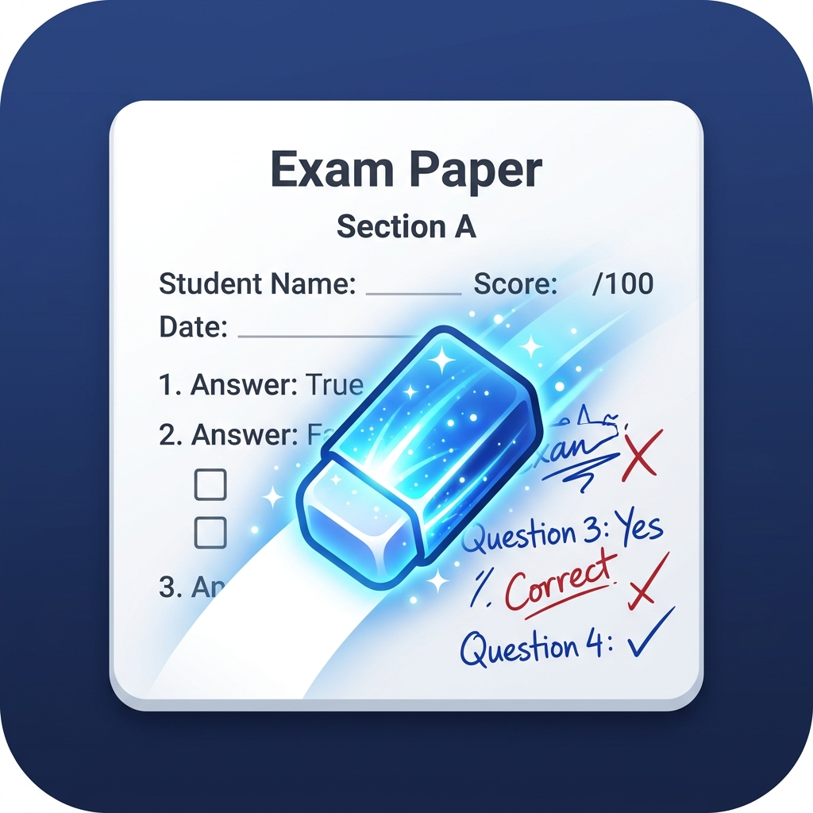

# Magic Eraser - 考卷手寫筆記去除工具 ✨

這是一款專為學生與教師打造的高效能 Windows 桌面應用程式，能夠全自動化地將掃描考卷上的「紅色」與「藍色」手寫筆跡完美擦除，還原出乾淨、可重新列印的空白考卷！



## 🌟 核心特色 (Features)

*   **極速批量處理:** 支援一次匯入多張高解析度考卷掃描檔，一鍵點擊即可全部轉換，無需逐張操作。
*   **100倍加速去灰白化:** 內建優化過的底層光照推估演算法，能瞬間將灰暗、有陰影的掃描背景還原為「純白」，讓印出來的考卷不浪費碳粉。
*   **精準筆跡消除:** 採用最新的 HSV 形態學識別與邊緣膨脹技術，徹底消除所有紅藍色原子筆跡的殘留與暈染。
*   **黑字絕對保護罩:** 獨家研發的保護機制，能準確識別「黑色印刷體」與「色散邊緣」，在擦除筆跡時 100% 保護原有考卷題目不被破壞。
*   **現代化毛玻璃介面 (Glassmorphism):** 採用 2026 最流行的毛玻璃 UI 設計，半透明的質感加上順暢的響應式圖片縮放，帶來頂級的使用者體驗。

## 🚀 系統需求與安裝 (Installation)

這是一個基於 Python 與 OpenCV 的輕量級工具，**無需顯示卡 (GPU)**，純 CPU 即可達到秒殺級的處理速度。

### 1. 環境需求
*   Windows 10 / 11 作業系統
*   Python 3.8 以上版本 (推薦使用最新版)

### 2. 安裝套件
在專案目錄下開啟終端機，執行以下指令安裝必要的套件：
```bash
pip install -r requirements.txt
```
*(主要依賴：`opencv-python`, `numpy`, `PyQt6`)*

## 💡 使用教學 (How to Use)

1.  **啟動程式:**
    點擊兩下 `main.py` 或在終端機輸入：
    ```bash
    python main.py
    ```
2.  **載入考卷:**
    點擊「📂 載入圖片」，支援用滑鼠框選或按住 `Ctrl` 鍵一次選擇多張考卷圖片。程式載入時會**自動幫您把背景漂白**。
3.  **確認設定:**
    上方設定區預設為「紅+藍皆去除」，這能應付 90% 的情況。如果您只想保留其中一種顏色的筆跡，也可以單獨選擇。
4.  **一鍵轉換:**
    點擊綠色大按鈕「✨ 全部轉換 ✨」，程式就會開始依序擦除底下所有考卷的筆跡。
5.  **儲存結果:**
    您可以看著下方排排站的預覽圖，點選右側的「💾 儲存此圖片」單獨存檔；或是點擊左上角的「💾 全部儲存」，選擇一個資料夾，程式會一次打包存進去（自動加上 `_processed` 標籤，不覆蓋原圖）。

## ⚙️ 進階功能 (Advanced Settings)

*   **使用智慧修補 (Inpaint):**
    預設關閉。當您處理的圖片背景非常複雜（例如有花紋或網點的背景）時，可以打勾。程式會利用周圍的像素來修補被擦除的筆跡空洞。對於一般的純白背景考卷，不需要開啟。
*   **增強黑白對比:**
    處理完成後，進一步拉高黑白對比度，讓文字看起來更像純文字檔。

## 👨‍💻 開發者筆記 (Developer Notes)

*   **為何不使用 AI (RTX 3060)?**
    雖然使用 PyTorch 建立深度學習模型來去背是可行的，但本程式採用了純粹的「電腦視覺形態學 (Morphology)」與色彩空間轉換 (HSV)。經過特殊參數調教後，純 CPU 運算速度極快且準確率極高，大幅降低了使用者的硬體門檻與環境設定的麻煩。
*   **UI 設計:**
    介面使用 `PyQt6` 構建，透過自訂的 `QSS` 與 `QGraphicsDropShadowEffect` 實現了流暢的「業態毛玻璃」效果。圖片預覽模組也經過重寫，解決了高解析度圖片帶來的記憶體堆疊與 UI 無限縮放卡死的問題。

---
*Built with ❤️ for perfectly clean exam papers.*
